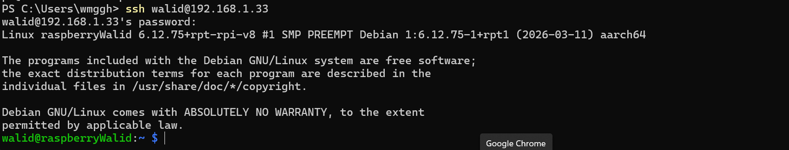

### 🟢 LEVEL 1 – Prise en main de la Raspberry Pi

Ce premier niveau m'a permis de configurer l'environnement de base de la Raspberry Pi de manière autonome, d'établir une connexion sécurisée et de comprendre le fonctionnement des LEDs via le système de fichiers Linux.

#### 🛠️ Tâches réalisées
- [x] Installer Raspberry Pi OS et configurer le réseau Wi-Fi
- [x] Activer SSH et se connecter depuis l'ordinateur
- [x] Identifier l'adresse IP de la Raspberry Pi sur le réseau local (`192.168.1.33`)
- [x] Vérifier que les LEDs intégrées (verte et rouge) sont accessibles via le système de fichiers (`/sys/class/leds/`)
- [x] Écrire un script Python basique qui allume et éteint les LEDs intégrées via les fichiers système

#### 📸 Preuves de réalisation (Screenshots)

##### A. Connexion SSH réussie
*Capture d'écran de mon terminal lors de la première connexion à la Raspberry Pi :*


##### B. Accès aux fichiers système des LEDs
*Preuve que les dossiers `ACT` (verte) et `PWR` (rouge) sont bien présents dans `/sys/class/leds/` :*


#### 📦 Livrable : Script Python de test (`leds.py`)
Le script ci-dessous permet de modifier la valeur du fichier `brightness` (0 pour éteindre, 1 pour allumer) pour faire clignoter les LEDs verte (ACT) et rouge (PWR) :

```python
import time

# Chemin vers les LEDs 
ledRouge = "/sys/class/leds/PWR/brightness"
ledVerte = "/sys/class/leds/ACT/brightness"

# Boucle infini
while True:
        open(ledRouge,"w").write("0") # Ecrit 0 dans le fichier de la led rouge pour l'éteindre
        time.sleep(1) # Attend 1 seconde
        open(ledVerte,"w").write("1") # Ecrit 1 dans le fichier de la led verte pour l'allumer
        time.sleep(1)
        open(ledVerte,"w").write("0")
        time.sleep(1)
        open(ledRouge,"w").write("1")
        time.sleep(1)
